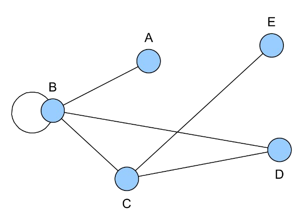
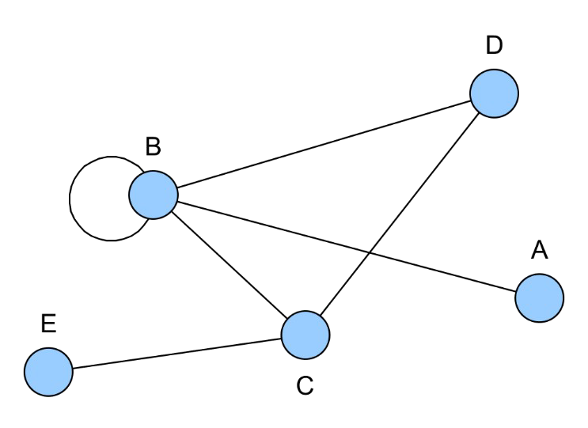
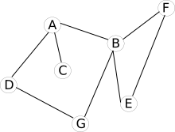
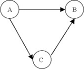
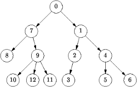
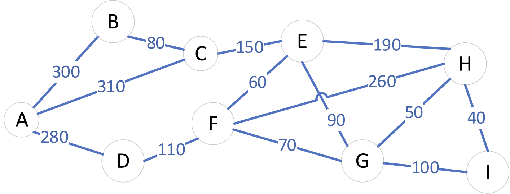
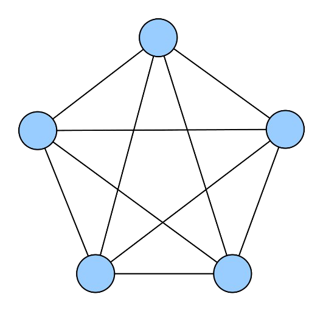
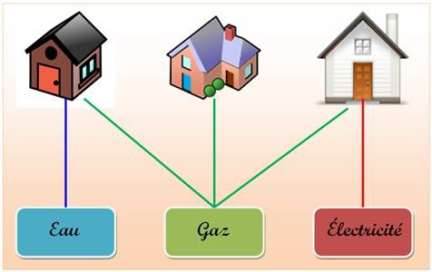
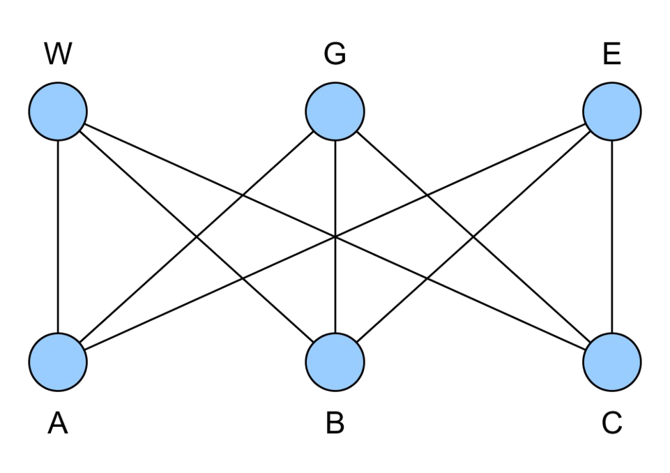
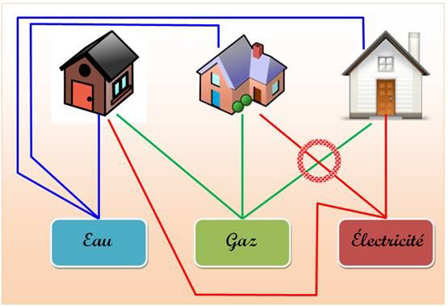

# Graphes

!!! quote "Introduction"
	Dans cette première partie nous allons définir les notions de graphes orientés et non orientés, s'intéresser à leurs représentations graphiques et présenter quelques généralités.

	En général, un graphe est un ensemble d'objets, appelés sommets ou parfois noeuds (vertex or nodes en anglais) reliés par des arêtes ou arcs selon que le graphe est non orienté ou orienté (edge en anglais).

## **A quoi servent les graphes ? Exemples**

- Informatique: réseau internet (représentation des routeurs), représentation des relations entre différentes tables (BD).

- Les réseaux : sociaux, routiers, aériens, de distribution de biens ou d'énergie…

- Mathématiques, biologie, physique, chimie, génétique…

---

## **1) Graphes non orientés**

La définition d'un graphe non orienté correspond tout à fait à l'idée que l'on s'en fait intuitivement : un ensemble de points, dont certains sont reliés par des lignes parcourables dans les deux sens.

Par exemple, cela peut représenter un réseau social. M et D sont reliés par une relation d'amitié (relation symétrique). M est aussi ami avec H, V, L et J…

!!! note "Définition"
	On utilise les notations anglo-saxonnes, **V** pour _Vertices_ (_Sommets_) et **E** pour _Edge_ (_arêtes)_.

	Un graphe non orienté G = (V, E) est défini par :

	- d’un ensemble V = {v~1~, v~2~, …v~n~} dont les éléments v~i~ sont appelés les **sommets** du graphe.

	- d’un ensemble E = {e~1~, e~2~, …e~n~} dont les éléments e~i~ sont appelés les **arêtes** du graphe.

	Si l’arête e~i~ relie les sommets A et B, on dira que ces sommets sont **adjacents** ou **voisins**.

	Les arêtes sont des paires de sommets : chaque arête e~i~ s’écrit sous la forme {v~k~, v~m~} avec v~k~, v~m~ ∈ _V_.

	La **représentation sagittale** d’un graphe non orienté est sa représentation sous forme de schéma, les sommets étant modélisés par des **disques** et les arêtes par des **lignes**.

**^^Exemple :^^**

Pour définir un graphe non orienté, il faut d'abord décrire l'ensemble de ses sommets : V = {A, B, C, D, E}

Ensuite, on peut alors donner l'ensemble de ses arêtes : E={{A, B},{B},{B, C},{B, D},{C, D},{E, C}}

Sa représentation sagittale est donc :

{ style="max-height:300px" }

A noter qu'un même graphe peut bien sûr avoir **plusieurs représentations sagittales**.

En voici par exemple une autre représentation sagittale du même graphe :

{ style="max-height:300px" }

Le sommet B possède une **boucle** (arête ne possédante qu'un seul élément)

!!! Example "Application:"
	**1)** _(d'après le graphe ci-dessus)_

	A et B sont / ne sont pas deux sommets adjacents ou voisins

	A et D sont / ne sont pas deux sommets non adjacents ou non voisins

	---

	**2)**

	V = {A, B, C, D, E, F et G}
	
	E = {{A, B}, {A, C}, {A, D}, {B, F}, {B, E},{B, G}, {D, G}, {E, F}}

	Dessiner sa représentation sagittale

	??? success "Corrigé"
		**1)**

		A et B **sont** / ~~ne sont pas~~ deux sommets adjacents ou voisins

		A et D **sont** / ~~ne sont pas~~ deux sommets non adjacents ou non voisins

		---
		**2)**

		{ style="max-height:200px" }

!!! note "Définitions"
	une **chaîne** est une suite de sommets reliés par des arêtes. La **longueur** de la chaîne est égale au nombre d'arêtes.

	Un **cycle** est une suite d'arêtes consécutives distinctes (chaîne simple) dont les deux sommets extrémités sont identiques

	Un graphe est **connexe** s’il existe pour tous les sommets, une chaîne les reliant (un graphe est connexe s’il est ‘en un seul morceau’)

	**L’ordre d’un graphe** le nombre n de sommets de ce graphe.
	
	Le **degré d’un sommet** est le nombre de sommets qui lui sont adjacents
	
	Le **degré d’un graphe** le degré maximum de tous ses sommets.
	
	Un graphe **simple** est un graphe ne comportant ni boucles ni multi-arêtes, c'est-à-dire qu'aucun sommet n'est connecté à lui-même, et entre deux sommets il n'existe qu'une seule arête.
	
	Un graphe est **planaire** s’il admet une représentation sagittale où ses arêtes (ou arcs) ne se coupent pas.
	
	Un graphe non orienté est **complet** s’il est simple et si deux sommets quelconques sont reliés par une arête.
 
!!! info "Remarque"
	* Pour un graphe non orienté, la somme des degrés de ses sommets est égale à **2** fois le nombre de ses arêtes. lorsqu’on fait la somme des degrés des sommets, chaque arête est comptée deux fois.

	* Les arbres sont des graphes connexes où il n’existe pas de cycle.

---

## **2) Graphes orientés**

{ align=right }

Dans un **graphe orienté,** on va imposer une direction sur les liaisons entre sommets.

La relation entre A et B est orientée de A vers B

Par exemple, on pourrait dire que A est plus grand que B, et A est plus grand que C, et C est plus grand que B.

---

{ align=right }

On rencontre par exemple des graphes orientés à travers la notion d'arborescence (arbres):

- c'est un arbre dont chaque arête est remplacée par une relation orientée qu'on appelle arc;

- le sommet 0 est appelé la "racine"

Un **arbre** est donc un **graphe orienté** ne possédant aucun cycle.

Il possède une seule racine tel que tous les nœuds sauf la racine ont un unique prédécesseur (parent)

^^-Application en informatique :^^ l'arborescence des fichiers sur un ordinateurs

!!! note "Définition"
	Un graphe orienté G = (V, E) est défini par :

	- d’un ensemble V = {v~1~, v~2~, …v~n~} dont les éléments v~i~ sont appelés les **sommets** du graphe.

	- d’un ensemble E = {e~1~, e~2~, …e~n~} dont les éléments sont des couples d'éléments de **V**, et sont appelés les **arcs** du graphe. Chaque arc e~i~ s'écrit (v~k~, v~m~) avec v~k~, v~m~ ∈ _V_.

	Un **chemin** est une suite de sommets reliés par des arcs.

	Un graphe orienté est **faiblement connexe** si le graphe non orienté associé est connexe (graphe obtenu en transformant les arcs en arêtes, on ne considère plus l’orientation des arcs).

	Un graphe orienté est **fortement connexe** s'il existe un chemin (orienté) du sommet a au sommet b et du sommet b au sommet a, quels que soient les sommets représentés par a et b dans le graphe.

^^**Exemple**^^ :

Pour définir un graphe orienté, il faut donc commencer par décrire l'ensemble de ses sommets :

V={A, B, C, D, E}

On peut alors donner l'ensemble de ses arcs :

E={(A, A), (A, B), (B, D), (C, B), (C, D), (D, C), (E, A)}

!!! warning "Attention"
	(A, B) ≠ (B, A) : l'ordre des éléments définissant l'arc est important à cause de l'orientation.
	
	Dans (A, B), A est la première composante de l'arc et B la seconde composante.

!!! tip ""
	Ainsi, on peut définir pour chaque sommet son **degré sortant** (égal au nombre d’arcs dont il est la première composante) de son **degré entrant** (égal au nombre d’arcs dont il est la seconde composante)

!!! tip ""
	Soit un arc (x, y), on dit que y est un **successeur** de x et que x est un **prédécesseur** de y.

	On dit également que x est **l’origine** de l’arc (x,y) et que y est son **extrémité**.

!!! tip ""
	Un graphe orienté est **complet** si chaque paire de sommets est reliée par exactement deux arcs (un dans chaque sens)

---

## **3) Graphes pondérés**

Un graphe est **pondéré** (ou valué) si on attribue à chaque arête (ou arc) une valeur numérique (la plupart du temps positive), qu'on appelle _mesure_, _poids_, _coût_ ou _valuation_.

!!! info "Remarque"
	- Dans le protocole OSPF, on pondère les liaisons entre routeurs par le coût.

	- Dans un réseau routier entre plusieurs villes, on pondère par les distances.

**^^Exemple d’un graphe non orienté pondéré :^^**

{ style="max-height:300px" }

---

## **Représentation des graphes**

Pour représenter un graphe en langage machine, on utilise deux méthodes principales :

- à l’aide de listes de successeurs ou de prédécesseurs ;

- à l’aide de matrice d’adjacence (le coefficient a~i,j~ traduit l’existence ou non d’une liaison entre le sommet i et le sommet j).

### **I) Listes de successeurs**

!!! note "Définition"
	**Listes de successeurs :** à chaque sommet on associe la liste de tous ses voisins dans le cas d'un graphe non orienté ou de ses successeurs dans le cas d'un graphe orienté.

Représentation en machine du graphe :

-	On utilise un dictionnaire de listes qui est appelée dans ce cas **liste d'adjacence**.

-	Les clés du dictionnaire sont les sommets. La valeur associée à un sommet est la liste des successeurs de ce sommet. (On peut aussi utiliser la liste de prédécesseurs).

-	La liste des successeurs et celle des prédécesseurs sont identiques dans un graphe non orienté.

-	Dans le cas d’un graphe pondéré, les listes sont remplacées par des dictionnaires. Le graphe est alors un dictionnaire de dictionnaires : le dictionnaire de successeurs a pour clés les étiquettes des sommets successeurs et pour valeurs les valuations des arêtes associées.

## **Pour les plus curieux**

**^^Circuits imprimés :^^**

Des pistes de circuits imprimés qui ne se croisent jamais.

C'est le cas des circuits imprimés. Le courant doit aller d'un point à un autre en parcourant une piste sans croiser une autre piste. Ce n'est pas toujours possible. Il faut alors ajouter une nouvelle couche de circuits. Le plus simple étant le double-face, mais certains circuits complexes peuvent compter huit ou dix couches.

---

**^^Application :^^**

Le graphe suivant est-il planaire ? graphe K5

{ style="max-height:300px" }

??? success "Réponse"
	**Non**

	(Démonstration [villemin.gerard.free.fr](http://villemin.gerard.free.fr/aMaths/Topologi/aaaGraph/Planaire.htm))

---

**^^Énigme :^^**

Proposée en 1903 par Sam Loyd puis en 1917 par Henry Ernest Dudeney.

Trois maisons doivent être chacune reliées à trois usines d’eau, de gaz et d’électricité. Peut-on disposer les canalisations de telle sorte qu’elles ne se chevauchent pas ?

Ci-dessous figure l'illustration originale de l'auteur du problème :

{ style="max-height:300px" }

Il est facile de voir que les maisons, usines et canalisations peuvent être modélisées par ce graphe :

{ style="max-height:300px" }

La question peut alors se reformuler comme suit : le graphe précédent est-il planaire ?

??? success "Réponse"
	**Non**, ce graphe est noté K3,3

	Il est impossible de relier ces trois maisons aux trois ressources sans croisement des raccordements. La meilleure solution ne permet de poser huit raccordements sur neuf demandés.

	{ style="max-height:300px" }
